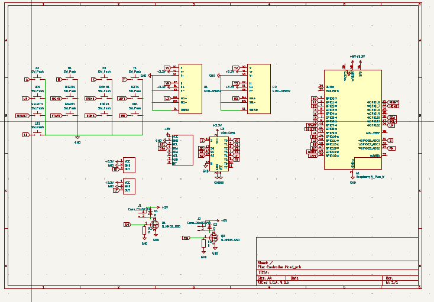
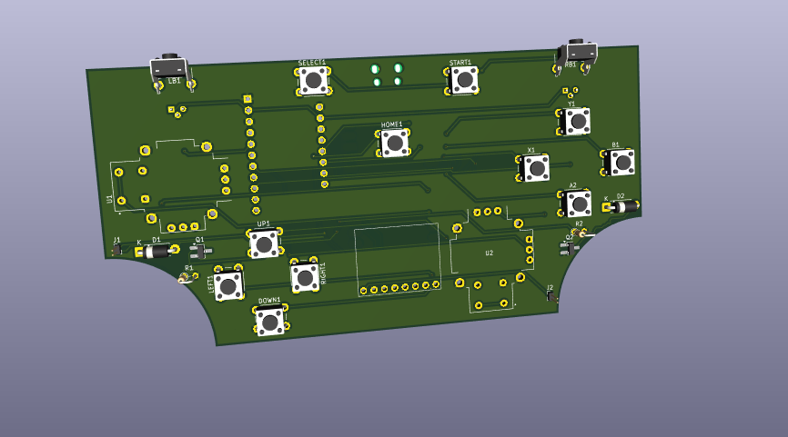
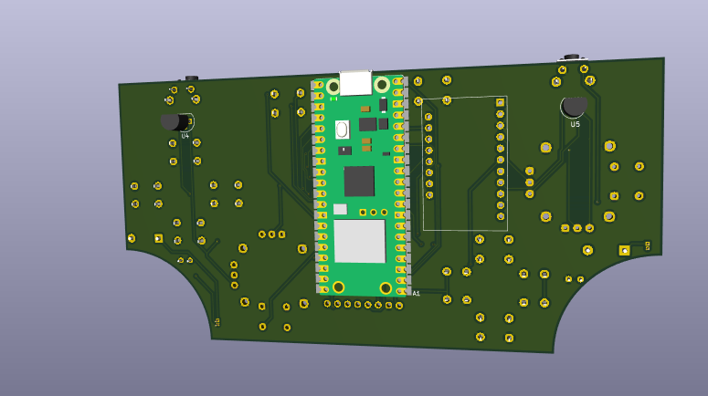
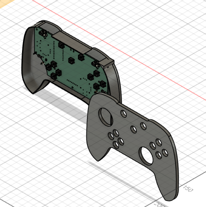
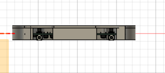
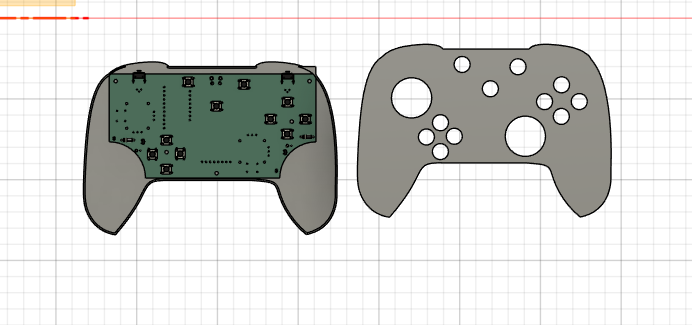

# Controller
This is xbox layout controller that have hall effect joystick,hall effect triggers,and two rumble motor,a,b,x,y,up,down,left,right,lb,rb,start,home,select and we use gp2040-ce firmware with pi pico W
# PCB 

# CAD

# BOM

| No | Product Name                             | Qty | Price / Piece (₹) |     Total (₹) | Total (USD) | Notes                 | Link                                                                                          |
| -: | ---------------------------------------- | --: | ----------------: | ------------: | ----------: | --------------------- | --------------------------------------------------------------------------------------------- |
|  1 | Tactile Push Button Switch 6×6×5         |  14 |              2.00 |         28.00 |        0.02 | —                     | [Link](https://robu.in/product/6x6x5-tactile-push-button-switch/)                             |
|  2 | Raspberry Pi Pico W                      |   1 |            614.00 |        614.00 |        6.81 | —                     | [Link](https://robu.in/product/raspberry-pi-pico-w/)                                          |
|  3 | 2PCS Hall Effect Sensor Joystick         |   1 |            847.00 |        847.00 |        9.40 | —                     | [Link](https://www.amazon.in/dp/B0CNWYWCYN)                                                   |
|  4 | CJMCU-4051 (74HC4051) Analog Multiplexer |   1 |             76.00 |         76.00 |        0.84 | —                     | [Link](https://robu.in/product/cjmcu-4051-74hc4051-8-channel-analog-multiplexer/)             |
|  5 | AO3400A MOSFET (30V, 5.2A)               |   2 |              6.00 |         12.00 |        0.13 | —                     | [Link](https://robu.in/product/ao3400a-mosfet/)                                               |
|  6 | 1N4148W Diode (75V, 150mA, SOD)          |   2 |              1.43 |          2.86 |        0.03 | —                     | [Link](https://robu.in/product/1n4148w-slkor-75v-1v-4ns-150ma-sod-123-switching-diodes-rohs/) |
|  7 | 10kΩ 0.5W Metal Film Resistor            |   2 |              0.98 |          1.96 |        0.02 | —                     | [Link](https://robu.in/product/10k-ohm-0-5w-metal-film-resistor-pack-of-50/)                  |
|  8 | Neodymium Magnet 4mm × 2mm (2 pcs)       |   1 |             11.80 |         11.80 |        0.13 | —                     | [Link](https://roboticsdna.in/product/4mm-x-2mm-neodymium-disc-strong-magnet-2-piece/)        |
|  9 | MPU-6050 3-Axis Accelerometer            |   1 |            173.00 |        173.00 |        1.92 | —                     | [Link](https://robu.in/product/mpu-6050-gyro-sensor-2-accelerometer/)                         |
| 10 | Honeywell Hall Effect Sensor (SS49E)     |   2 |            106.00 |        212.00 |        2.35 | —                     | [Link](https://robu.in/product/honeywell-board-mount-hall-effect-magnetic-sensors-ss49e/)     |
| 11 | 4000 RPM 5V DC Vibration Motor           |   2 |             29.00 |        137.00 |        1.52 | 58 + 79 Delivery      | [Link](https://electronicspices.com/product/4000-rpm-5v-dc-vibration-rumble-motor)            |
| 12 | PCB (JLCPCB)                             |   1 |           1934.74 |       1934.74 |       21.06 | 7.20 + 13.86 Delivery | [Link](https://jlcpcb.com/)                                                                   |
| 13 | 3D Printed Enclosure                     |   1 |           1995.00 |       1995.00 |       22.13 | —                     | [Link](https://robu.in/product/3d-printing-service/)                                          |
|    | **Total**                                |     |                   | **₹ 6019.36** | **$ 66.37** |                       |                                                                                               |
